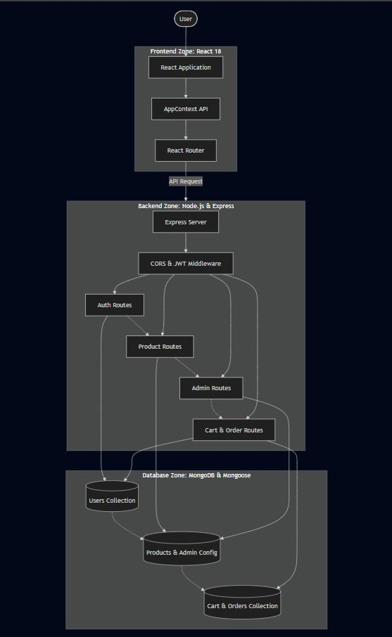
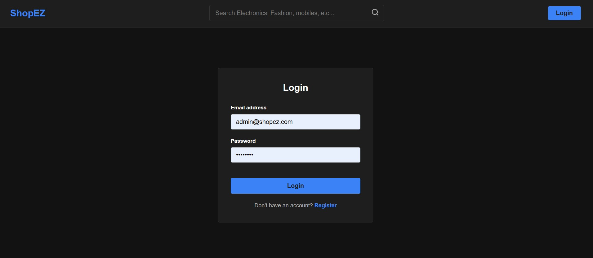
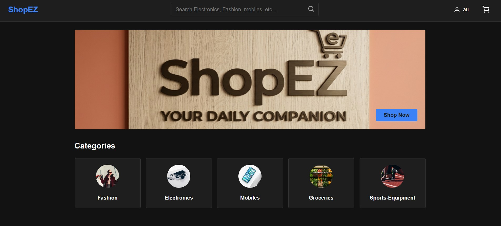
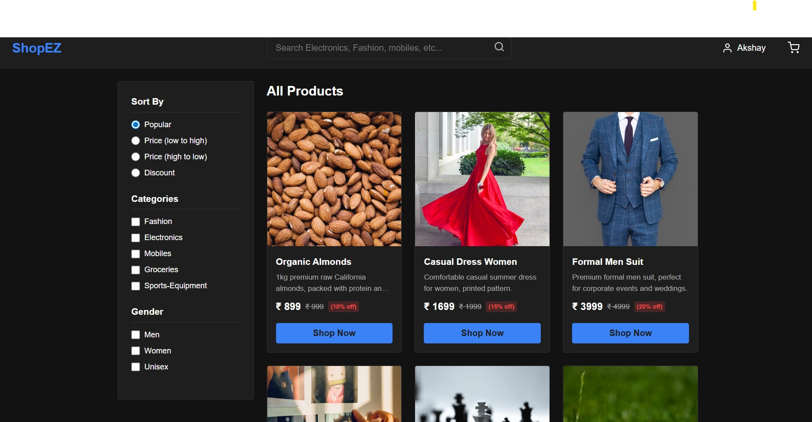
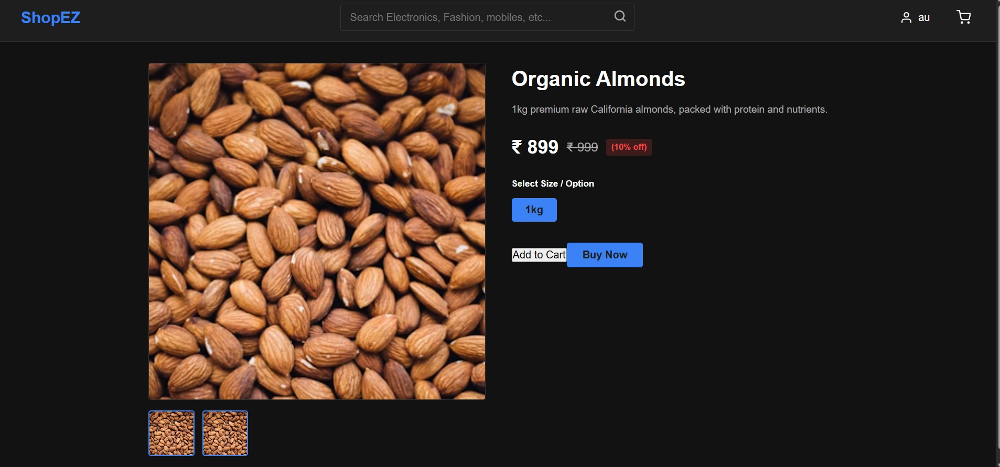
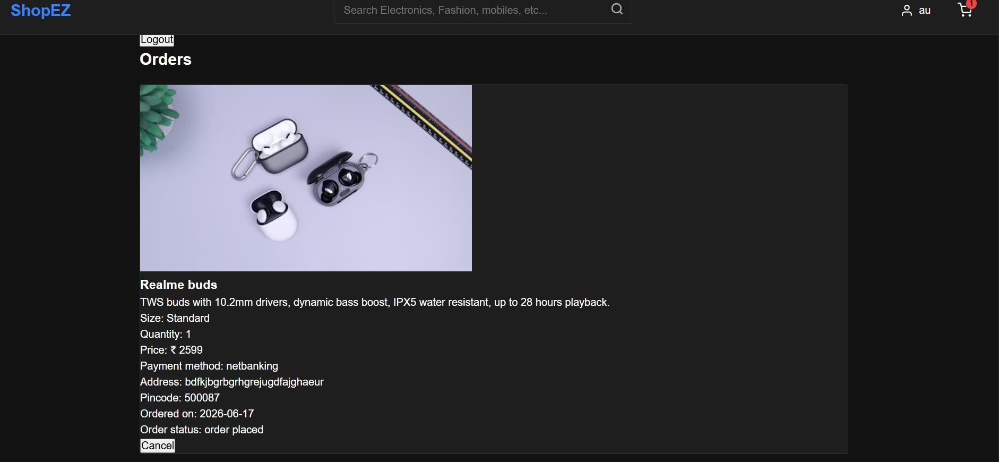
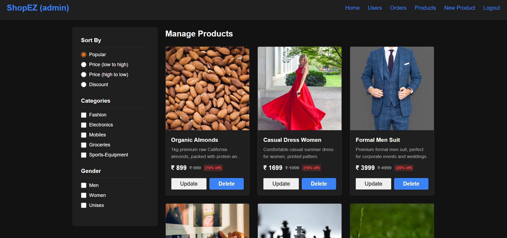
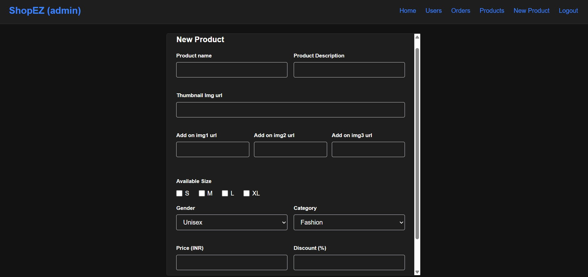

# Full Stack Development with MERN: ShopEZ Project Documentation

## 1. Introduction

- **Project Title:** ShopEZ (E-Commerce Platform)
- **Developer:** Banka Akshay Kumar Reddy
- **Repository:** [github.com/akshayb9640/VIP-C2---E-Commerce](https://github.com/akshayb9640/VIP-C2---E-Commerce)
- **Last Updated:** 18 June 2026

---

## 2. Project Overview

ShopEZ is a modern, fully functional e-commerce web application built on the MERN stack (MongoDB, Express.js, React.js, Node.js). It is designed to give shoppers a fast and seamless browsing experience while empowering store administrators with a comprehensive, unified dashboard — all within a single codebase.

**Core Features:**
- Secure user registration and login with role-based access control (Customer vs. Admin).
- Product catalog with dynamic category filtering and detailed product views.
- Real-time shopping cart management with live item count updates.
- Smooth checkout flow and order placement.
- Admin panel for full CRUD management of products, orders, categories, and promotional banners.
- Light/Dark mode toggle driven entirely by CSS variables — no third-party theme libraries required.

---

## 3. Architecture



The application follows a clean, decoupled three-tier architecture. The React frontend communicates with the Express backend exclusively through REST API calls. The backend handles business logic and communicates with MongoDB through Mongoose.

### Frontend Architecture (React.js)

- **Framework & Build Tool:** React.js 18 bootstrapped with Vite, chosen for its near-instant Hot Module Replacement (HMR) and highly optimized production builds compared to Create React App.
- **Routing:** React Router DOM v6 enables client-side navigation without full page reloads. Routes are protected by role-based guards — a non-admin user attempting to access `/admin` is immediately redirected.
- **State Management:** The React Context API (`AppContext`) serves as the single source of truth for global application state — managing the active user session, JWT token, cart item count, and search queries without any third-party state management library.
- **Data Fetching:** Asynchronous API calls are made using the native `fetch` API and `Axios`, with JWT tokens attached to every protected request via the `Authorization` header.
- **Styling:** A bespoke CSS system built on CSS custom properties (`--bg-color`, `--text-color`, etc.) enables a seamless, flash-free Light/Dark theme toggle. The Admin Dashboard forces a specialized dark theme by injecting a class into the `<body>` tag.
- **Icons:** Lucide-React provides a consistent set of lightweight, accessible SVG icons.

### Backend Architecture (Node.js & Express.js)

- **Framework:** Express.js 4.x running on Node.js powers the RESTful API. Its middleware-driven design makes it easy to layer security, logging, and error handling.
- **Modular Routing:** Routes are separated into distinct modules — `authRoutes`, `productRoutes`, `orderRoutes`, `cartRoutes`, and `adminRoutes` — each delegating to dedicated controllers for clean separation of concerns.
- **Security & Middleware:**
  - CORS middleware is configured to allow cross-origin requests from the React dev server (port 5173) while blocking unknown origins.
  - A custom authentication middleware validates the Bearer JWT on every protected endpoint before allowing the request to proceed. Invalid or missing tokens immediately return a `401 Unauthorized`.
- **Password Security:** Bcryptjs salts and hashes all user passwords with 10+ rounds before storage. Plaintext passwords never touch the database.

### Database (MongoDB & Mongoose)

- **Database:** MongoDB is the data store of choice, selected for its document-oriented flexibility — perfect for an evolving product catalog where attributes differ per product.
- **ODM:** Mongoose 6.x enforces structured schemas and adds validation at the application level.
- **Key Schemas:**

| Schema | Purpose |
| :--- | :--- |
| `users` | Stores credentials (email, hashed password, username) and role (`usertype`). |
| `admin` | Holds global store config — active hero banner and category list. |
| `products` | Full product metadata: title, description, price, discount, sizes, category, image URL. |
| `cart` | User-specific cart items referencing product IDs and quantities. |
| `orders` | Completed transactions with shipping details, items, total cost, and status (Pending / Shipped / Delivered). |

---

## 4. Setup Instructions

### Prerequisites
- Node.js (v14 or higher)
- MongoDB (local installation or a MongoDB Atlas connection string)
- Git

### Installation Steps

**1. Clone the Repository**
```bash
git clone https://github.com/akshayb9640/VIP-C2---E-Commerce.git
cd VIP-C2---E-Commerce
```

**2. Install Backend Dependencies**
```bash
cd server
npm install
```

**3. Configure Environment Variables**

Create a `.env` file inside the `server/` directory:
```env
PORT=8000
MONGO_URI=mongodb://127.0.0.1:27017/shopez
JWT_SECRET=your_jwt_secret_key
```

**4. Install Frontend Dependencies**
```bash
cd ../client
npm install
```

---

## 5. Folder Structure

```
VIP-C2---E-Commerce/
│
├── client/                        # React frontend (Vite)
│   └── src/
│       ├── components/            # Reusable UI components (Navbar, ProductCard, etc.)
│       ├── pages/                 # Route-level views (Landing, Products, Cart, Admin, etc.)
│       ├── App.jsx                # Root routing + Context Provider setup
│       ├── index.css              # Global CSS reset, variables, and theme definitions
│       └── main.jsx               # React DOM entry point
│
├── server/                        # Node.js + Express backend
│   ├── routes/                    # API route definitions
│   ├── controllers/               # Business logic and DB interaction handlers
│   ├── middleware/                # Auth validation and error-handling middleware
│   ├── Schema.js                  # All Mongoose schemas and model exports
│   ├── db.js                      # MongoDB connection initialization
│   ├── index.js                   # Server entry point and middleware setup
│   └── seed.js                    # Database seeding script for sample data
│
├── templates/                     # Phase-wise project documentation templates
│   └── Phase-Wise Templates/      # Filled templates organized by development phase
│
└── screenshots/                   # Application screenshots for documentation
```

---

## 6. Running the Application

Open two separate terminal windows and run the following:

**Backend Server** *(Terminal 1)*
```bash
cd server
npm run dev
```
> Runs on `http://localhost:8000`

**Frontend Dev Server** *(Terminal 2)*
```bash
cd client
npm run dev
```
> Runs on `http://localhost:5173`

---

## 7. API Documentation

| Method | Endpoint | Description | Auth Required |
| :--- | :--- | :--- | :--- |
| POST | `/api/auth/register` | Register a new user with username, email, password. | No |
| POST | `/api/auth/login` | Authenticate user. Returns a JWT token on success. | No |
| GET | `/api/products` | Fetch all products. Supports optional category filter. | No |
| GET | `/api/products/:id` | Fetch a single product's full details. | No |
| POST | `/api/products` | Add a new product to the catalog. | Admin JWT |
| PUT | `/api/products/:id` | Update an existing product's details. | Admin JWT |
| DELETE | `/api/products/:id` | Remove a product from the catalog. | Admin JWT |
| GET | `/api/cart` | Retrieve the logged-in user's cart items. | Customer JWT |
| POST | `/api/cart` | Add an item to the cart (productId, quantity). | Customer JWT |
| DELETE | `/api/cart/:id` | Remove a specific item from the cart. | Customer JWT |
| GET | `/api/orders` | View the authenticated user's order history. | Customer JWT |
| POST | `/api/orders` | Place a new order and clear the current cart. | Customer JWT |
| GET | `/api/settings` | Fetch global store settings (banners, categories). | No |

---

## 8. Authentication Flow

ShopEZ uses stateless **JSON Web Token (JWT)** authentication throughout:

1. **Registration/Login:** The Express server generates a JWT signed with the `JWT_SECRET` key upon successful login and returns it to the client.
2. **Client Storage:** The React client stores the token in `localStorage` so the session persists across browser refreshes.
3. **Protected Requests:** For any endpoint requiring authentication, the client attaches the JWT in the HTTP `Authorization` header as `Bearer <token>`.
4. **Server Validation:** The custom `authMiddleware` intercepts every protected request, decodes and verifies the token, and attaches the decoded user payload to `req.user`. If the token is missing, expired, or tampered with, the server immediately returns `401 Unauthorized`.

---

## 9. User Interface

The UI is built from the ground up using custom CSS — deliberately avoiding heavy component libraries to maintain fine-grained control over performance and aesthetics.

- **Responsive Design:** CSS Flexbox and Grid layouts ensure components adapt fluidly from 4K desktops down to 320px mobile screens.
- **Light/Dark Mode:** Driven entirely by CSS custom properties, the theme toggle is instant and flash-free. The Admin Dashboard defaults to a focused dark theme to ease prolonged use.

**Key User Journeys:**

| Journey | Description |
| :--- | :--- |
| Landing Page | Hero banner with active promotions followed by category navigation cards. |
| Product Discovery | Responsive product grid with one-click category filters. |
| Product Detail | Full-resolution imagery, description, size selection, and direct Add to Cart. |
| Cart & Checkout | Clear order summary, shipping details form, and final order confirmation. |
| Admin Dashboard | Sidebar navigation with data tables for product CRUD and live order monitoring. |

---

## 10. Testing Strategy

| Testing Type | Method | Scope |
| :--- | :--- | :--- |
| API Validation | Postman / Thunder Client | Verified all endpoints for correct status codes (200, 201, 401, 404) and JWT blocking. |
| End-to-End (Manual) | Browser-based flow testing | Full user journeys: Register → Login → Browse → Cart → Checkout → Admin Fulfillment. |
| Cross-Browser | Chrome, Firefox, Safari | CSS layout consistency and JavaScript execution verified across modern browsers. |
| Responsive Testing | Chrome DevTools Device Mode | Mobile (320px) to tablet (768px) viewports tested for layout integrity. |
| State Debugging | React Developer Tools | Context API state changes (cart count, user session) verified across component tree. |

---

## 11. Screenshots

### Login Page


### Home Page


### Products Page


### Buying a Product


### Order History


### Admin Page - Order Management


### Adding a New Product (Admin)


---

## 12. Known Issues

- Image uploads rely on direct URL inputs rather than file uploads to a cloud storage provider (e.g., Cloudinary or AWS S3). This means broken links if the source URL goes down.
- The "Forgot Password" / email-based password reset flow has not been implemented yet.

---

## 13. Future Enhancements

- **Payment Gateway Integration:** Integrate Stripe or Razorpay to support live online transactions.
- **User Reviews & Ratings:** Allow customers to leave star ratings and written reviews on individual product pages.
- **Cloudinary Integration:** Enable direct image uploads from the Admin Panel with automatic cloud hosting and optimization.
- **Advanced Search & Filtering:** Implement faceted search by price range, size, brand, and category simultaneously.
- **Email Notifications:** Send automated transactional emails for order confirmations and shipping updates.
- **Analytics Dashboard:** Add an admin-facing analytics view for tracking sales trends, top products, and user activity.
